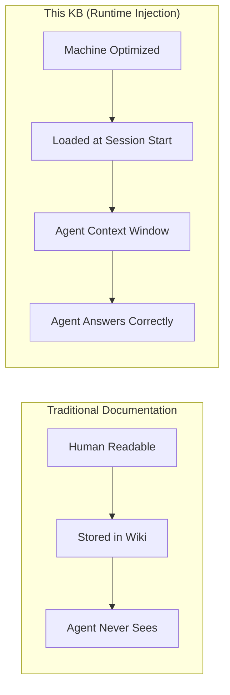
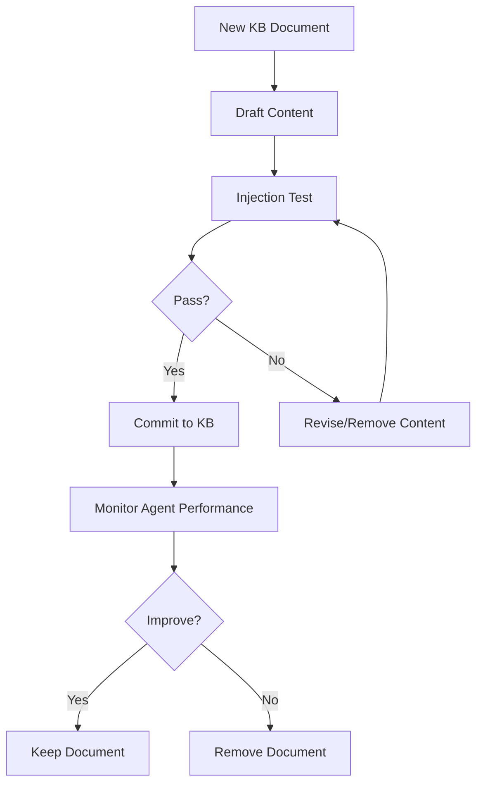
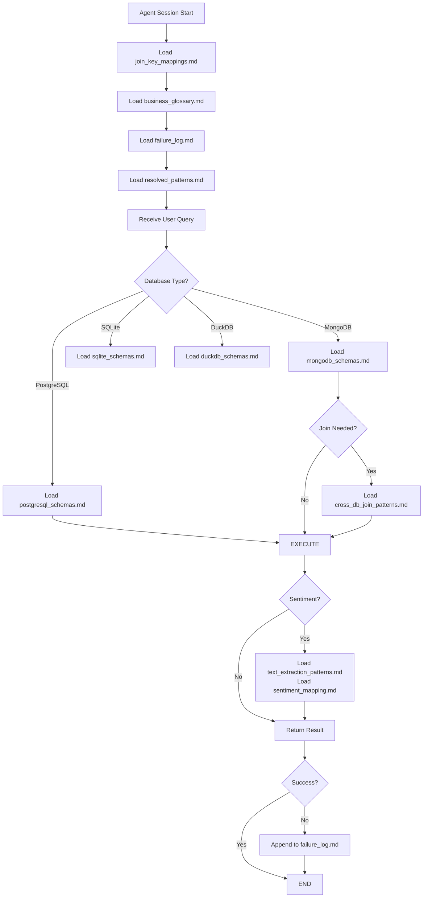

# KNOWLEDGE BASE ARCHITECTURE NOTES

### Complete Reference for Intelligence Officers & Team Members

---

## Document Information

| Property | Value |
|----------|-------|
| **Document Type** | KB Architecture Reference |
| **Target Audience** | Intelligence Officers, Drivers, All Team Members |
| **Purpose** | Understand KB structure, file purposes, and injection points |
| **Last Updated** | 2026-04-10 |
| **Version** | 3.0.0 |

---

## PART 1: HIGH-LEVEL ARCHITECTURE OVERVIEW

### 1.1 What Is This Knowledge Base?

The Knowledge Base is a **runtime context injection system**—not documentation. Each file is designed to be pasted directly into an LLM's context window before query execution.



### 1.2 Core Design Principles

| Principle | Meaning | How Enforced |
|-----------|---------|--------------|
| **Injected, not summarized** | Document works standalone in LLM context | Injection test with fresh session |
| **Specific to this problem** | No LLM-pretrained knowledge included | Remove generic facts, keep DAB-specific |
| **Maintained, not archived** | Outdated content removed, not preserved | CHANGELOG.md + weekly audit |
| **Verified before committing** | Every change passes injection test | CI/CD blocks failing PRs |

### 1.3 The Karpathy Method

> "Minimum content, maximum precision, verified by injection test."

**The discipline is removal, not accumulation.**



## PART 2: DIRECTORY STRUCTURE

### 2.1 Complete Tree View

```markdown
kb/
│
├── 📄 README.md                          # Complete system documentation
├── 📄 CHANGELOG.md                       # Version history across all versions
├── 📄 INJECTION_TEST_LOG.md              # Evidence that all docs pass tests
├── 🐍 injection_test.py                  # Python script for validation
├── 📜 run_injection_tests.sh             # Shell test runner
├── 📦 requirements-injection-test.txt    # Python dependencies
│
├── 📁 architecture/                   # HOW the agent should work
│   ├── 📄 CHANGELOG.md
│   ├── 📄 01_three_layer_memory.md
│   ├── 📄 02_autodream_consolidation.md
│   ├── 📄 03_tool_scoping_philosophy.md
│   ├── 📄 04_openai_six_layers.md
│   ├── 📄 05_conductor_worker_pattern.md
│   └── 📄 06_evaluation_harness_schema.md
│
├── 📁 domain/                         # WHAT the data means
│   ├── 📄 CHANGELOG.md
│   ├── 📁 databases/
│   │   ├── 📄 postgresql_schemas.md
│   │   ├── 📄 mongodb_schemas.md
│   │   ├── 📄 sqlite_schemas.md
│   │   └── 📄 duckdb_schemas.md
│   ├── 📁 joins/
│   │   ├── 📄 join_key_mappings.md
│   │   └── 📄 cross_db_join_patterns.md
│   ├── 📁 unstructured/
│   │   ├── 📄 text_extraction_patterns.md
│   │   └── 📄 sentiment_mapping.md
│   └── 📁 domain_terms/
│       └── 📄 business_glossary.md
│
├── 📁 correction/                    # SELF-LEARNING loop
│   ├── 📄 CHANGELOG.md
│   ├── 📄 failure_log.md
│   ├── 📄 failure_by_category.md
│   ├── 📄 resolved_patterns.md
│   └── 📄 regression_prevention.md
│
└── 📁 evaluation/                        # SCORING reference
    ├── 📄 dab_scoring_method.md
    └── 📄 submission_format.md
```

### 2.2 Directory Purposes

| Directory | Purpose | When Used | Update Frequency |
|-----------|---------|-----------|------------------|
| `architecture/` | Teach agent HOW to organize itself | Every session start | Weekly (as new patterns emerge) |
| `domain/` | Provide DAB-specific data knowledge | Every session + on-demand per DB type | Weekly (as new schemas understood) |
| `correction/` | Enable self-learning from failures | Every session start + append on failure | Real-time (failures) + Weekly (autoDream) |
| `evaluation/` | Define scoring and submission rules | Evaluation runs only | As needed |

---

## PART 3: ROOT FILES

### 3.1 README.md

| Property | Value |
|----------|-------|
| **Purpose** | Complete system documentation for all team members |
| **Content** | Architecture diagrams, setup instructions, test procedures, integration guide |
| **Inject to Agent?** | NO - human documentation only |
| **Maintainer** | Intelligence Officers |

**Key Sections:**

- Architecture diagrams (Mermaid)
- Installation & setup
- Running injection tests
- Integration with agent
- Maintenance procedures
- Troubleshooting

### 3.2 CHANGELOG.md

| Property | Value |
|----------|-------|
| **Purpose** | Track all changes across all KB versions |
| **Content** | Version history with dates, added/changed/removed files |
| **Inject to Agent?** | NO - human audit trail only |
| **Maintainer** | Intelligence Officers |

**Format:**

```markdown
## [v3.0.0] - 2026-04-10

### Added - v3 Corrections Layer
- failure_log.md - Chronological record of failures
- resolved_patterns.md - Permanent fixes with confidence scores
```

### 3.3 INJECTION_TEST_LOG.md

| Property | Value |
|----------|-------|
| **Purpose** | Evidence that every document passes injection tests |
| **Content** | Table of test dates, questions, expected answers, results |
| **Inject to Agent?** | NO - quality assurance evidence only |
| **Maintainer** | Automated (injection_test.py) |

**Format:**

| Date | Document | Test Question | Expected | Result |
|------|----------|---------------|----------|--------|
| 2026-04-10 | v1/01_memory.md | What are three layers? | MEMORY.md, topic files, transcripts | PASS |

### 3.4 injection_test.py

| Property | Value |
|----------|-------|
| **Purpose** | Automated validation that KB documents work when injected |
| **Content** | Python script using Groq Llama 3.3 70B |
| **Inject to Agent?** | NO - development tool only |
| **Usage** | `python injection_test.py --kb-path ./kb` |

**What it does:**

1. Creates fresh LLM session with ONLY one document
2. Asks predefined test question
3. Verifies answer contains expected keywords
4. Requires ≥70% keyword match to pass

### 3.5 run_injection_tests.sh

| Property | Value |
|----------|-------|
| **Purpose** | One-command test runner for all documents |
| **Content** | Bash script that checks API key, installs deps, runs tests |
| **Inject to Agent?** | NO - development tool only |
| **Usage** | `./run_injection_tests.sh` |

### 3.6 requirements-injection-test.txt

| Property | Value |
|----------|-------|
| **Purpose** | Python dependencies for injection testing |
| **Content** | `groq>=0.9.0` |
| **Inject to Agent?** | NO - development dependency file |

---

## PART 4: V1-ARCHITECTURE LAYER (HOW)

### 4.1 Overview

**Purpose:** Teach the agent HOW to organize itself, manage memory, use tools, and route queries.

**Injection Timing:** Every session start (core documents) + on-demand

**Size Constraint:** Max 400 words per file

### 4.2 File: 01_three_layer_memory.md

```markdown
| Property | Value |
|----------|-------|
| **Purpose** | Claude Code's memory architecture pattern |
| **Inject When** | Session start (always in context) |
| **Inject Where** | Conductor agent context |
| **Test Question** | "What are the three layers of Claude Code's memory system?" |
```

**Content Summary:**

```markdown
Layer 1 - MEMORY.md (index): Points to all other KB docs. Never exceeds 500 lines.
Layer 2 - Topic Files (on-demand): Loaded only when referenced. Max 400 words each.
Layer 3 - Session Transcripts (searchable): Full logs, autoDream consolidates weekly.
```

**Why Needed:** Without this, agent doesn't know how to manage its own context window. Will try to load everything at once → overflow.

**Injection Point:**

```python
# At conductor agent initialization
conductor.load_kb("architecture/01_three_layer_memory.md")
```

### 4.3 File: 02_autodream_consolidation.md

```markdown
| Property | Value |
|----------|-------|
| **Purpose** | Pattern for compressing session transcripts into persistent memory |
| **Inject When** | Fridays only (when autoDream runs) OR never (tool for developers) |
| **Inject Where** | autoDream consolidator script |
| **Test Question** | "When does autoDream run and what does it do?" |
```

**Content Summary:**

```text
Input: Session transcripts (last 10 sessions)
Output: Updated resolved_patterns.md

Process:
1. Extract [query] → [wrong] → [correct] triples
2. Cluster by failure category
3. Add confidence scores
4. Write to resolved_patterns.md
5. Remove resolved from failure_log.md
```

**Why Needed:** Prevents failure_log.md from growing indefinitely. Compresses 50 failures into 5 high-confidence patterns.

**Injection Point:**

```python
# In autodream_consolidator.py (runs via cron Friday 23:00)
consolidator.load_kb("architecture/02_autodream_consolidation.md")
```

### 4.4 File: 03_tool_scoping_philosophy.md

```markdown
| Property | Value |
|----------|-------|
| **Purpose** | Why narrow, specific tools outperform generic ones |
| **Inject When** | Session start (tool design principles) |
| **Inject Where** | Conductor agent context (tool selection logic) |
| **Test Question** | "Why are 40+ tight tools better than 5 generic tools?" |
```

**Content Summary:**

```text
Claude Code: 40+ tools, each single responsibility
- query_postgres(sql, db) → JSON (not generic "query_database")
- resolve_join_key(value, source, target) → transformed

Why: MongoDB needs aggregation pipeline, not SQL.
Join key transformation is separate capability.
```

**Why Needed:** Prevents agent from creating one massive "do_everything" tool that fails on DB-specific operations.

**Injection Point:**

```python
# Tool selection logic
if "mongodb" in db_type:
    # This decision comes from tool_scoping_philosophy.md
    agent.use_tool("query_mongodb", not "query_database")
```

### 4.5 File: 04_openai_six_layers.md

```markdown
| Property | Value |
|----------|-------|
| **Purpose** | OpenAI's context architecture with Oracle Forge minimum (3 layers) |
| **Inject When** | Session start |
| **Inject Where** | Conductor agent context |
| **Test Question** | "What are the minimum three context layers for Oracle Forge?" |
```

**Content Summary:**

```text
OpenAI 6 Layers:
1. Schema & Metadata (always)
2. Institutional Knowledge (which tables authoritative)
3. Interaction Memory (corrections)
4. Query Patterns (successful past queries)
5. Table Enrichment (semantic summaries)
6. Self-Correction (retry loop)

Oracle Forge Minimum (3 layers that demonstrably work):
- Layer A: Schema (load per DB type)
- Layer B: Institutional (joins + terms - always loaded)
- Layer C: Correction (failure_log.md - always loaded)
```

**Why Needed:** Gives agent a proven mental model for organizing context. Without this, agent doesn't know what to keep vs discard.

**Injection Point:**

```python
# Context management
agent.context_layers = {
    "schema": load_per_db(),
    "institutional": ["join_key_mappings.md", "business_glossary.md"],
    "correction": ["failure_log.md", "resolved_patterns.md"]
}
```

### 4.6 File: 05_conductor_worker_pattern.md

```markdown
| Property | Value |
|----------|-------|
| **Purpose** | Multi-agent routing for cross-database queries |
| **Inject When** | Session start (routing logic) + on each multi-DB query |
| **Inject Where** | Conductor agent (orchestration) |
| **Test Question** | "How does the agent handle multi-database queries?" |
```

**Content Summary:**

```text
Conductor Agent:
- Parses query → identifies needed databases
- Spawns workers with DB-specific KB subsets
- Merges results, resolves conflicts

Workers:
- PostgreSQL worker: gets postgresql_schemas.md
- MongoDB worker: gets mongodb_schemas.md + join_key_mappings.md

On failure: log to corrections, retry with fix
```

**Why Needed:** DAB queries frequently require joining PostgreSQL + MongoDB in same query. Without this pattern, agent tries to query both with same tool → fails.

**Injection Point:**

```python
# Query routing
if "postgresql" in required_dbs and "mongodb" in required_dbs:
    conductor.load_kb("architecture/05_conductor_worker_pattern.md")
    conductor.spawn_workers()
```

### 4.7 File: 06_evaluation_harness_schema.md

```markdown
| Property | Value |
|----------|-------|
| **Purpose** | Define trace schema and pass@1 scoring |
| **Inject When** | Evaluation runs only (not during normal query processing) |
| **Inject Where** | Evaluation harness |
| **Test Question** | "What is pass@1 and how is it calculated?" |
```

**Content Summary:**

```text
Trace Schema: Every tool call logged with input, output, duration, success
pass@1 = (correct first answers) / (total queries)
Minimum 50 trials per query
95% confidence interval reported

Regression: If score drops >2%, reject change
```

**Why Needed:** Ensures evaluation is consistent across team members and comparable to DAB leaderboard.

**Injection Point:**

```python
# Evaluation harness
harness.load_kb("evaluation/dab_scoring_method.md")
harness.load_kb("architecture/06_evaluation_harness_schema.md")
```

## PART 5: V2-DOMAIN LAYER (WHAT)

### 5.1 Overview

**Purpose:** Provide DAB-specific knowledge that the LLM was NOT pretrained on.

**Injection Timing:** Session start (core) + on-demand per database type

**Size Constraint:** Max 400 words per file

### 5.2 File: databases/postgresql_schemas.md

```markdown
| Property | Value |
|----------|-------|
| **Purpose** | PostgreSQL schemas for Yelp, Telecom, Healthcare datasets |
| **Inject When** | When query involves PostgreSQL data |
| **Inject Where** | PostgreSQL worker agent |
| **Test Question** | "What is the format of Yelp business_id?" |
```

**Content Summary:**

```text
Yelp.business:
- business_id (TEXT, PK) - format: "abc123def456"
- stars (FLOAT) - 1.0 to 5.0
- review_count (INT)

Telecom.subscribers:
- subscriber_id (INT, PK) - 7-10 digits
- churn_date (DATE) - NULL if active

Critical: Customer IDs are INT in PG, "CUST-{INT}" in MongoDB
```

**Why Needed:** LLM doesn't know Yelp's specific business_id format or that Telecom uses INT IDs. Without this, agent generates wrong join keys.

**Injection Point:**

```python
if "postgresql" in query_databases:
    pg_worker.load_kb("domain/databases/postgresql_schemas.md")
```

### 5.3 File: databases/mongodb_schemas.md

```markdown
| Property | Value |
|----------|-------|
| **Purpose** | MongoDB schemas with nested documents and string prefixes |
| **Inject When** | When query involves MongoDB data |
| **Inject Where** | MongoDB worker agent |
| **Test Question** | "What is the format of customer_id in MongoDB telecom collection?" |
```

**Content Summary:**

```text
Telecom.subscribers:
{
  "customer_id": "CUST-1234567",  // STRING with prefix
  "plan_type": "postpaid"
}

Yelp.reviews (embedded in business):
{
  "review_id": "xyz789",
  "user_id": "USER-12345",  // Different format than PG
  "text": "Great place!"
}

Critical: MongoDB IDs are STRINGS with prefixes. PG IDs are INTs without.
```

**Why Needed:** LLM doesn't know MongoDB uses "CUST-{INT}" while PG uses INT. Without this, direct join fails silently.

**Injection Point:**

```python
if "mongodb" in query_databases:
    mongo_worker.load_kb("domain/databases/mongodb_schemas.md")
    mongo_worker.load_kb("domain/joins/join_key_mappings.md")  # Critical pair
```

### 5.4 File: databases/sqlite_schemas.md

```markdown
| Property | Value |
|----------|-------|
| **Purpose** | Lightweight transaction database schemas |
| **Inject When** | When query involves SQLite |
| **Inject Where** | SQLite worker agent |
| **Test Question** | "What format are customer_ids in SQLite?" |
```

**Content Summary:**

```text
Transactions table:
- transaction_id (INTEGER, PK)
- customer_id (INTEGER) - same as PostgreSQL (INT, no prefix)
- transaction_date (TEXT) - ISO format

Note: SQLite uses INTEGER IDs, same as PostgreSQL.
MongoDB requires transformation: f"CUST-{customer_id}"
```

**Why Needed:** SQLite uses same INT format as PostgreSQL, but different from MongoDB. Agent needs to know when to transform vs when to use directly.

**Injection Point:**

```python
if "sqlite" in query_databases:
    sqlite_worker.load_kb("domain/databases/sqlite_schemas.md")
```

### 5.5 File: databases/duckdb_schemas.md

```markdown
| Property | Value |
|----------|-------|
| **Purpose** | Analytical columnar database schemas |
| **Inject When** | When query involves DuckDB (analytical aggregation) |
| **Inject Where** | DuckDB worker agent |
| **Test Question** | "What is DuckDB used for in DAB?" |
```

**Content Summary:**

```text
Sales fact table:
- sale_id (BIGINT)
- customer_id (INTEGER)
- amount (DECIMAL)
- sale_date (DATE)

Time dimension with fiscal calendar:
- fiscal_year, fiscal_quarter

Important: Telecom fiscal Q3 = Oct-Dec (not calendar Jul-Sep)
```

**Why Needed:** DuckDB is for analytical aggregations (GROUP BY, window functions). Agent needs to know when to route to DuckDB vs PG. Also fiscal calendar differences.

**Injection Point:**

```python
if "analytical" in query_type or "aggregation" in query_type:
    duckdb_worker.load_kb("domain/databases/duckdb_schemas.md")
    duckdb_worker.load_kb("domain/domain_terms/business_glossary.md")  # For fiscal calendar
```

### 5.6 File: joins/join_key_mappings.md

```markdown
| Property | Value |
|----------|-------|
| **Purpose** | Exact transformation rules for cross-database joins |
| **Inject When** | Session start (ALWAYS - most critical file) |
| **Inject Where** | Conductor agent (join resolution logic) |
| **Test Question** | "How do I join PostgreSQL subscriber_id to MongoDB?" |
```

**Content Summary:**

```text
Telecom:
- PG: subscriber_id = 1234567 (INT)
- Mongo: customer_id = "CUST-1234567" (STRING)
- Transformation: f"CUST-{subscriber_id}"

Healthcare:
- PG: patient_id = 987654321 (INT)
- Mongo: patient_id = "PT-987654321" (STRING)
- Transformation: f"PT-{patient_id}"

Detection logic:
1. Check if one side INT, other STRING with prefix
2. Extract numeric: re.search(r'\d+', string_value)
3. Apply transformation based on table name
```

**Why Needed:** This is the #1 reason DAB agents fail. Without exact transformation rules, agent attempts direct INT=STRING join → empty result → no error message → silent failure.

**Injection Point:**

```python
# ALWAYS load at session start - most important file
conductor.load_kb("domain/joins/join_key_mappings.md")  # Priority 1

# On join attempt
join_result = conductor.resolve_join(
    left_value=1234567,
    left_db="postgresql",
    right_db="mongodb",
    mapping=join_key_mappings  # From this file
)
```

### 5.7 File: joins/cross_db_join_patterns.md

```markdown
| Property | Value |
|----------|-------|
| **Purpose** | Step-by-step patterns for multi-database joins |
| **Inject When** | When performing cross-database join |
| **Inject Where** | Conductor agent (join orchestration) |
| **Test Question** | "What are the steps for PostgreSQL to MongoDB join?" |
```

**Content Summary:**

```text
Pattern 1: PG → Mongo (One-to-Many)
1. Query PG for customer_ids
2. Transform each: f"CUST-{id}"
3. Query Mongo with $in: transformed_ids
4. Merge results on transformed key

Pattern 2: Three-Way Join (PG → Mongo → DuckDB)
1. PG worker: base transactions
2. Mongo worker: ticket counts using transformed IDs
3. Conductor merges PG + Mongo
4. DuckDB worker: analytical aggregation on merged results

Failure recovery: If join empty, check format mismatch, apply transform, retry
```

**Why Needed:** Join key mappings tell WHAT transformation to apply. This file tells HOW to orchestrate the multi-step join process.

**Injection Point:**

```python
# When conductor detects cross-database join needed
if len(set(databases)) > 1:
    conductor.load_kb("domain/joins/cross_db_join_patterns.md")
    conductor.execute_join_pattern(pattern="pg_to_mongo")
```

### 5.8 File: unstructured/text_extraction_patterns.md

```markdown
| Property | Value |
|----------|-------|
| **Purpose** | Regex and NLP patterns for extracting structured data from free text |
| **Inject When** | When query involves unstructured fields (review.text, issue_description) |
| **Inject Where** | Worker that queries the unstructured field (MongoDB or PG worker) |
| **Test Question** | "How do I extract negative sentiment from support ticket text?" |
```

**Content Summary:**

```text
Sentiment extraction from support_tickets.issue_description:
negative_indicators = ['frustrated', 'angry', 'terrible', 'not working', ...]

def extract_sentiment(text):
    text_lower = text.lower()
    is_negative = any(indicator in text_lower for indicator in negative_indicators)
    return 'negative' if is_negative else 'non-negative'

Yelp review fact extraction:
def extract_mentioned_facilities(text):
    facilities = ['parking', 'wifi', 'outdoor seating']
    return [f for f in facilities if f in text.lower()]

CRITICAL: Never return raw text when query asks for count.
Always extract THEN count.
```

**Why Needed:** DAB queries often ask "count negative sentiment mentions" or "find reviews mentioning parking." LLM often returns raw text instead of count. This file provides the extraction logic.

**Injection Point:**

```python
if "sentiment" in query or "extract" in query:
    worker.load_kb("domain/unstructured/text_extraction_patterns.md")
    
    # Apply extraction before counting
    extracted = extract_sentiment(text_field)
    count = len([e for e in extracted if e == 'negative'])
```

### 5.9 File: unstructured/sentiment_mapping.md

```markdown
| Property | Value |
|----------|-------|
| **Purpose** | Complete sentiment lexicon with negation handling |
| **Inject When** | When query asks for sentiment analysis |
| **Inject Where** | Worker processing unstructured text |
| **Test Question** | "How does negation affect sentiment classification?" |
```

**Content Summary:**

```text
Negative indicators (always .lower()):
frustrated, angry, terrible, awful, worst, broken, not working, failed,
error, complaint, unhappy, disappointed, useless, waste

Negation handling:
- "not good" → negative (flips positive to negative)
- "not bad" → non-negative (flips negative to non-negative)

Implementation:
if ' not ' in text_lower:
    for indicator in negative_indicators:
        if f'not {indicator}' in text_lower:
            return 'non-negative'  # Negation flips
```

**Why Needed:** Simple keyword matching fails on "not good" (should be negative) and "not bad" (should be non-negative). This file adds negation detection.

**Injection Point:**

```python
if "sentiment" in query:
    worker.load_kb("domain/unstructured/sentiment_mapping.md")
    sentiment = get_sentiment_with_negation(text)  # From this file
```

### 5.10 File: domain_terms/business_glossary.md

```markdown
| Property | Value |
|----------|-------|
| **Purpose** | Domain-specific definitions not in database schemas |
| **Inject When** | Session start (ALWAYS - second most critical) |
| **Inject Where** | Conductor agent (query interpretation) |
| **Test Question** | "What does 'active customer' mean in telecom?" |

**Content Summary:**

```
Telecom:
- "active customer": Purchased in last 90 days AND churn_date IS NULL
- "churn": churn_date IS NOT NULL (any date, not just 30 days)
- "fiscal quarter": Telecom Q3 = Oct-Dec (not calendar Jul-Sep)

Yelp:
- "popular business": review_count > 100 AND stars > 4.0
- "recent review": date > CURRENT_DATE - INTERVAL '30 days'

Healthcare:
- "readmission": same patient_id AND days_between < 30
```

**Why Needed:** LLM uses naive definitions ("active" = row exists). DAB expects specific definitions ("active" = purchased in last 90 days). Without this, agent answers correctly but wrong by benchmark standards.

**Injection Point:**

```python
# ALWAYS load at session start - second most important
conductor.load_kb("domain/domain_terms/business_glossary.md")  # Priority 2

# On query with ambiguous term
if "active customer" in query:
    definition = glossary["telecom"]["active_customer"]
    sql_where_clause = f"purchase_date > NOW() - INTERVAL '90 days' AND churn_date IS NULL"
```

---

## PART 6: V3-CORRECTIONS LAYER (SELF-LEARNING)

### 6.1 Overview

**Purpose:** Enable the agent to learn from its failures without retraining.

**Injection Timing:** Session start (ALWAYS) + append on failure

**Size Constraint:** No limit (autoDream compresses weekly)

### 6.2 File: failure_log.md

| Property | Value |
|----------|-------|
| **Purpose** | Chronological record of every agent failure and fix |
| **Inject When** | Session start (agent reads to avoid past mistakes) |
| **Inject Where** | Conductor agent context (prevention) |
| **Write When** | Every agent failure (appended) |
| **Test Question** | "What went wrong on Q023 and what's the fix?" |

**Format:**

```markdown
## 2026-04-10

**[Q023]** → Agent attempted to join PostgreSQL subscriber_id (INT) directly with MongoDB
**Correct:** Use resolve_join_key with f"CUST-{subscriber_id}"

**[Q045]** → Agent returned raw review.text when query asked for count
**Correct:** Extract with contains('parking') filter before counting
```

**Why Needed:** This is the agent's memory. Without it, agent makes same mistake repeatedly. With it, agent reads at session start and avoids known failure patterns.

**Injection Point:**

```python
# Session start - ALWAYS load
conductor.load_kb("correction/failure_log.md")

# On failure - append
with open("failure_log.md", "a") as f:
    f.write(f"\n**[{query_id}]** → {wrong}\n**Correct:** {correct}\n")
```

### 6.3 File: failure_by_category.md

| Property | Value |
|----------|-------|
| **Purpose** | Failures organized by DAB's 4 categories for fast lookup |
| **Inject When** | Session start (for categorization) |
| **Inject Where** | Conductor agent (when categorizing new failure) |
| **Test Question** | "What are DAB's four failure categories?" |

**Categories:**

```
Category 1: Multi-Database Routing Failure
- Agent queries only one DB when need both
- Fix: Conductor parses query, spawns multiple workers

Category 2: Ill-Formatted Join Key Mismatch
- INT vs "CUST-{INT}" string
- Fix: resolve_join_key with transformation

Category 3: Unstructured Text Extraction Failure
- Returns raw text instead of count
- Fix: extract THEN count

Category 4: Domain Knowledge Gap
- Uses naive definition instead of DAB-specific
- Fix: Load business_glossary.md
```

**Why Needed:** When new failure occurs, agent searches this file for similar pattern. Faster than scanning chronological log.

**Injection Point:**

```python
# On failure
category = classify_failure(wrong_approach)  # Returns one of 4
similar_failures = search_category(failure_by_category, category)
```

### 6.4 File: resolved_patterns.md

| Property | Value |
|----------|-------|
| **Purpose** | Permanent fixes with confidence scores (autoDream output) |
| **Inject When** | Session start (agent applies high-confidence patterns automatically) |
| **Inject Where** | Conductor agent (automatic fix application) |
| **Test Question** | "What is the confidence score for PG-INT to Mongo-String transformation?" |

**Format:**

```markdown
## Category: Join Key Transformation

### Pattern PG-INT to Mongo-String
**Confidence:** 14/14 successes
**Apply when:** source = PostgreSQL INT, target = MongoDB "CUST-{INT}"
**Transformation:** f"CUST-{source_value}"
```

**Why Needed:** After autoDream runs, resolved patterns are moved here from failure_log.md. Agent applies these automatically without checking failure_log.

**Injection Point:**

```python
# Session start - apply high-confidence patterns automatically
for pattern in resolved_patterns:
    if pattern.confidence > 0.9:
        conductor.register_autofix(pattern)
```

### 6.5 File: regression_prevention.md

| Property | Value |
|----------|-------|
| **Purpose** | Test set and rules to prevent breaking what already works |
| **Inject When** | After every agent change (regression test run) |
| **Inject Where** | Evaluation harness |
| **Test Question** | "What happens if regression test fails?" |

**Content Summary:**

```
Regression Test Set (run after EVERY change):
| Query ID | Failure | Fix |
| Q023 | INT→String join failed | resolve_join_key |
| Q045 | Returned raw text | extract_before_count |

Rules:
1. If any regression test fails → REVERT change
2. Log failure to failure_log.md
3. Do not deploy until all tests pass
```

**Why Needed:** Prevents "fixing" one query while breaking another. Ensures agent performance is monotonic (never decreases).

**Injection Point:**

```python
# After agent change
regression_results = harness.run_regression_tests(regression_prevention_set)
if any(not r.passed for r in regression_results):
    revert_change()
    log_failure("regression", regression_results)
```

---

## PART 7: EVALUATION LAYER (SCORING)

### 7.1 Overview

**Purpose:** Define how the agent is scored and how to submit to DAB leaderboard.

**Injection Timing:** Evaluation runs only (not during normal query processing)

### 7.2 File: dab_scoring_method.md

| Property | Value |
|----------|-------|
| **Purpose** | Define pass@1 calculation and confidence intervals |
| **Inject When** | Evaluation runs |
| **Inject Where** | Evaluation harness |
| **Test Question** | "What is pass@1?" |

**Content Summary:**

```
pass@1 = (correct first answers) / (total queries)
Minimum 50 trials per query
95% confidence interval using Wilson score

Current SOTA: 54.3% pass@1 (PromptQL + Gemini 3.1 Pro)
Target: >55% to beat SOTA
```

**Why Needed:** Ensures team calculates score same way as DAB leaderboard. Comparable results.

### 7.3 File: submission_format.md

| Property | Value |
|----------|-------|
| **Purpose** | Required format for GitHub PR to DAB repository |
| **Inject When** | Submission time |
| **Inject Where** | Submission script |
| **Test Question** | "What files are required for DAB submission?" |

**Content Summary:**

```
PR Title: "[Team Name] - TRP1 FDE Programme, April 2026"

Required files:
1. submission/team_name_results.json
2. AGENT.md (architecture description)

JSON format:
{
  "team_name": "Oracle Forge",
  "pass@1": 0.587,
  "confidence_interval": [0.542, 0.632],
  "trials_per_query": 50
}
```

---

## PART 8: INJECTION SUMMARY TABLE

### 8.1 When to Inject What

| Injection Timing | Documents | Priority |
|-----------------|-----------|----------|
| **Every Session Start (ALWAYS)** | `domain/joins/join_key_mappings.md` | 1 (CRITICAL) |
| | `domain/domain_terms/business_glossary.md` | 2 (CRITICAL) |
| | `correction/failure_log.md` | 3 (CRITICAL) |
| | `correction/resolved_patterns.md` | 4 |
| | `architecture/01_three_layer_memory.md` | 5 |
| | `architecture/05_conductor_worker_pattern.md` | 6 |
| **On PostgreSQL Query** | `domain/databases/postgresql_schemas.md` | DB-specific |
| **On MongoDB Query** | `domain/databases/mongodb_schemas.md` | DB-specific |
| | `domain/joins/join_key_mappings.md` (if join needed) | |
| **On SQLite Query** | `domain/databases/sqlite_schemas.md` | DB-specific |
| **On DuckDB Query** | `domain/databases/duckdb_schemas.md` | DB-specific |
| **On Unstructured Extraction** | `domain/unstructured/text_extraction_patterns.md` | Task-specific |
| | `domain/unstructured/sentiment_mapping.md` | |
| **On Join Operation** | `domain/joins/cross_db_join_patterns.md` | Task-specific |
| **On Failure** | Append to `correction/failure_log.md` | Write |
| **Weekly (Friday)** | Run autoDream on `correction/` | Maintenance |
| **Evaluation Only** | `architecture/06_evaluation_harness_schema.md` | Evaluation |
| | `evaluation/dab_scoring_method.md` | |
| | `evaluation/submission_format.md` | |

---

## PART 9: AGENT INTEGRATION CODE TEMPLATE

### 9.1 Complete Agent Initialization

```python
class OracleForgeAgent:
    def __init__(self, kb_path: str = "./kb"):
        self.kb_path = Path(kb_path)
        self.context = []
        self.failure_log = []
        
    def initialize_session(self):
        """Load all critical KB documents at session start"""
        critical_docs = [
            # Priority 1 - CRITICAL (always load)
            ("domain/joins/join_key_mappings.md", "join_mapping"),
            ("domain/domain_terms/business_glossary.md", "glossary"),
            ("correction/failure_log.md", "failures"),
            ("correction/resolved_patterns.md", "resolved"),
            # Priority 2 - Architecture
            ("architecture/01_three_layer_memory.md", "memory"),
            ("architecture/05_conductor_worker_pattern.md", "conductor"),
        ]
        
        for doc_path, name in critical_docs:
            self.load_kb(doc_path)
            print(f"[KB] Loaded: {name}")
    
    def load_kb(self, rel_path: str):
        """Load a KB document into agent context"""
        full_path = self.kb_path / rel_path
        if not full_path.exists():
            print(f"[WARN] KB document not found: {rel_path}")
            return
        
        with open(full_path, 'r', encoding='utf-8') as f:
            content = f.read()
        
        self.context.append({
            "role": "system",
            "content": f"# Knowledge Base: {rel_path}\n\n{content}"
        })
    
    def process_query(self, query: str, databases: list):
        """Process a query with on-demand KB loading"""
        
        # Load DB-specific schemas
        if "postgresql" in databases:
            self.load_kb("domain/databases/postgresql_schemas.md")
        
        if "mongodb" in databases:
            self.load_kb("domain/databases/mongodb_schemas.md")
            if "join" in query.lower() or "customer" in query.lower():
                self.load_kb("domain/joins/join_key_mappings.md")
        
        # Load unstructured extraction if needed
        if any(term in query.lower() for term in ["sentiment", "mention", "extract"]):
            self.load_kb("domain/unstructured/text_extraction_patterns.md")
            self.load_kb("domain/unstructured/sentiment_mapping.md")
        
        # Execute query
        result = self.execute_with_context(query)
        
        # Log if failure
        if not result.success:
            self.log_failure(query, result.error, result.fix)
        
        return result
    
    def log_failure(self, query: str, wrong: str, correct: str):
        """Append failure to corrections log"""
        entry = f"\n**[{datetime.now().isoformat()}]** → {wrong}\n**Correct:** {correct}\n"
        
        with open(self.kb_path / "correction/failure_log.md", 'a') as f:
            f.write(entry)
```

---

## PART 10: QUICK REFERENCE CARD

### 10.1 File Purpose Cheat Sheet

| File | One-Line Purpose | Inject? |
|------|-----------------|---------|
| `01_three_layer_memory.md` | How to manage context window | ✅ Session start |
| `02_autodream_consolidation.md` | How to compress failures weekly | ❌ Tool only |
| `03_tool_scoping_philosophy.md` | Why narrow tools beat generic | ✅ Session start |
| `04_openai_six_layers.md` | Proven context architecture | ✅ Session start |
| `05_conductor_worker_pattern.md` | How to route multi-DB queries | ✅ Session start |
| `06_evaluation_harness_schema.md` | How scoring works | ❌ Evaluation only |
| `postgresql_schemas.md` | Yelp/Telecom PG schemas | ✅ On PG query |
| `mongodb_schemas.md` | Nested docs + string prefixes | ✅ On Mongo query |
| `join_key_mappings.md` | INT→"CUST-{INT}" rules | ✅ ALWAYS (Priority 1) |
| `cross_db_join_patterns.md` | Step-by-step join process | ✅ On join |
| `text_extraction_patterns.md` | Regex for sentiment/facts | ✅ On extraction |
| `sentiment_mapping.md` | Negation-aware lexicon | ✅ On sentiment |
| `business_glossary.md` | "Active customer" definition | ✅ ALWAYS (Priority 2) |
| `failure_log.md` | Chronological mistakes | ✅ ALWAYS (Priority 3) |
| `failure_by_category.md` | Organized by DAB categories | ✅ Session start |
| `resolved_patterns.md` | High-confidence fixes | ✅ Session start |
| `regression_prevention.md` | Test set + rollback rules | ❌ After changes |

### 10.2 Critical Order of Operations



*These notes should be reviewed weekly by Intelligence Officers and referenced whenever adding new documents to the KB.*
